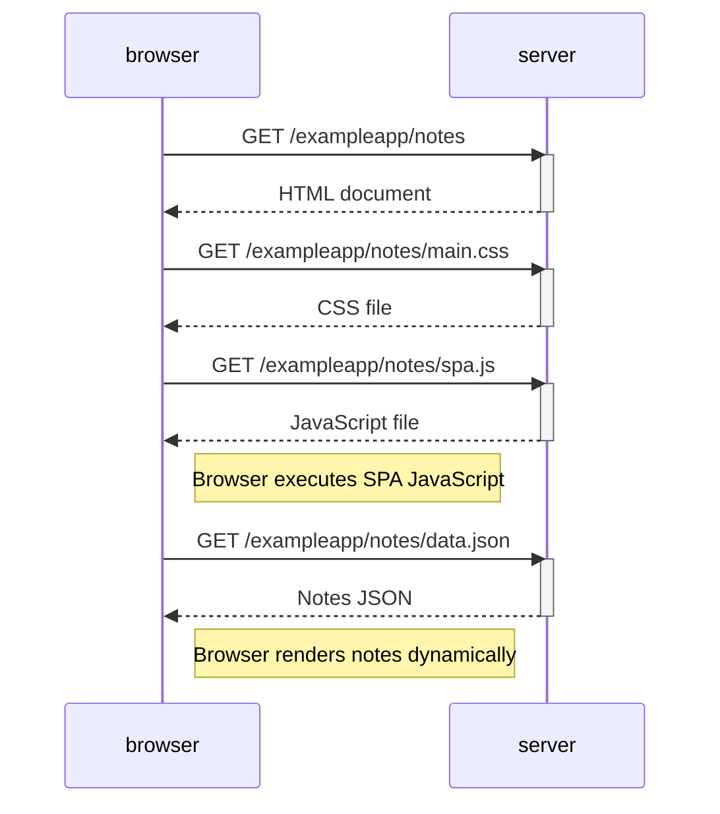

```mermaid
sequenceDiagram
    participant browser
    participant server

    browser->>server: GET /exampleapp/notes
    activate server
    server-->>browser: HTML document
    deactivate server

    browser->>server: GET /exampleapp/notes/main.css
    activate server
    server-->>browser: CSS file
    deactivate server

    browser->>server: GET /exampleapp/notes/spa.js
    activate server
    server-->>browser: JavaScript file
    deactivate server

    Note right of browser: Browser executes SPA JavaScript

    browser->>server: GET /exampleapp/notes/data.json
    activate server
    server-->>browser: Notes JSON
    deactivate server

    Note right of browser: Browser renders notes dynamically
```